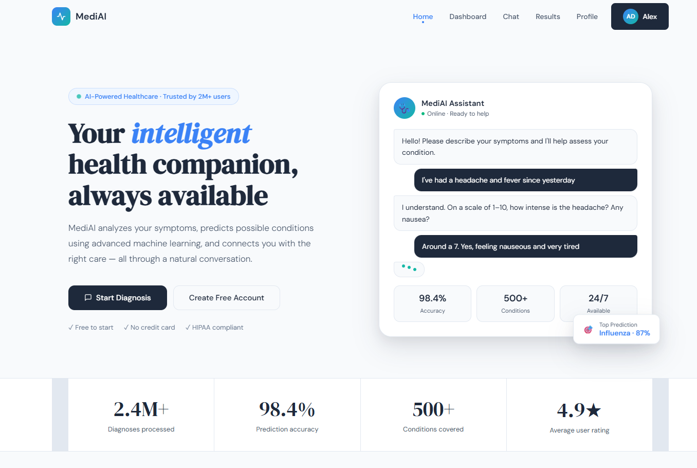
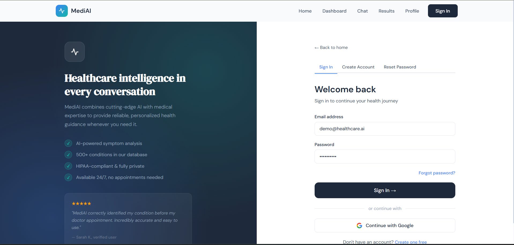
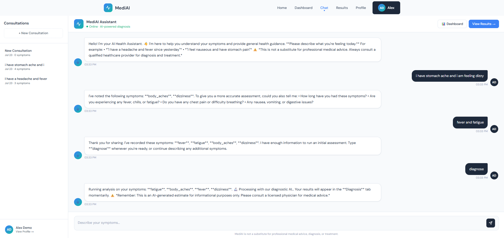
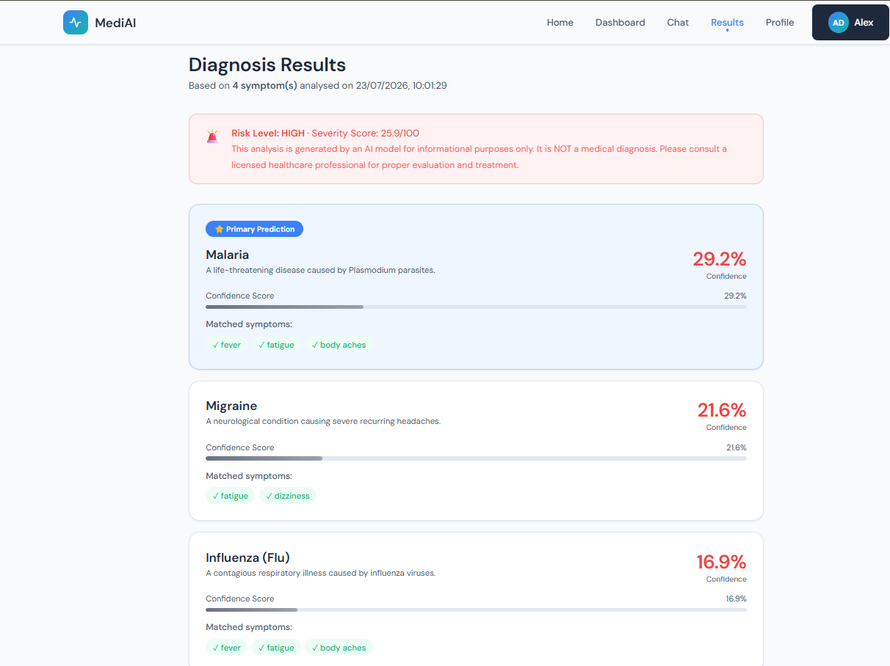

# 🩺 medAI — Health Diagnosis Assistant

A full-stack health assistant: a Flask REST API (JWT auth, SQLAlchemy) paired with a conversational HTML/CSS/JS frontend. Users describe symptoms in free text; the backend extracts them via keyword/alias matching, then predicts likely conditions using a 3-model ensemble (Random Forest, XGBoost, Logistic Regression) blended with rule-based Jaccard scoring, returning calibrated confidence scores, a risk level, and personalized recommendations across 15 supported conditions.

> Built as an independent project to explore end-to-end AI product design: a real ML pipeline, a documented REST API, JWT-based auth, and a full conversational frontend.

---

## Screenshots

**Landing page**


| Sign In | Chat — Symptom Extraction |
|---|---|
|  |  |

**Diagnosis Results — ML ensemble prediction**


---

## How it works

```
user free text ("I have a headache and fever")
  │
  ├─ keyword/alias symptom extraction   → canonical symptom list
  ├─ 3-model ensemble (RF + XGBoost + LR)  ┐
  │                                         ├─ blended 35% rule-based Jaccard
  ├─ rule-based Jaccard/coverage scoring  ┘   + 65% ML average
  │
  └─ ranked predictions + confidence + risk level + recommendations
```

The ML models are trained on a **synthetic dataset generated from the disease-symptom profiles** (not real patient data) — a reasonable approach for a prototype, and clearly disclosed here rather than implied otherwise.

---

## Tech Stack

| Layer | Technology |
|---|---|
| Frontend | HTML, CSS, Vanilla JavaScript |
| Backend | Flask, Flask-JWT-Extended, Flask-SQLAlchemy, Flask-Bcrypt |
| ML / NLP | scikit-learn (Random Forest, Logistic Regression), XGBoost, keyword/alias-based symptom extraction |
| Database | SQLite (dev) |
| Validation | Marshmallow schemas |

---

## Project Structure

```
medai/
├── frontend/
│   └── index.html
└── backend/
    ├── run.py                  # Entry point + CLI commands
    ├── requirements.txt
    ├── API_DOCS.md              # Full API reference
    ├── .env.example
    ├── config/
    │   ├── __init__.py
    │   └── settings.py         # Dev / Prod / Test configs
    └── app/
        ├── __init__.py          # Application factory
        ├── models/              # User, ChatSession, ChatMessage, DiagnosisResult, SymptomRecord
        ├── routes/              # /api/auth, /api/chat, /api/diagnosis, /api/profile, /api/health
        ├── services/            # auth_service, chat_service, ml_service
        ├── utils/                # schemas (Marshmallow), helpers
        └── ml/models/            # label_map.json (trained .pkl artifacts are gitignored — regenerate locally)
```

---

## Getting Started

### 1. Backend

```bash
cd backend
python -m venv venv
source venv/bin/activate          # Windows: venv\Scripts\activate
pip install -r requirements.txt

cp .env.example .env
# Open .env and set real values for SECRET_KEY and JWT_SECRET_KEY

flask init-db
flask seed-db          # creates a demo user — check console output for credentials
flask train-models     # trains and saves the ML ensemble locally

python run.py
# Backend running at http://localhost:5000
```

Confirm it's alive: open `http://localhost:5000/api/health` — should return `{"status": "healthy", ...}`.

### 2. Frontend

The frontend is a static file — serve it over HTTP rather than opening it directly (opening via `file://` breaks the CORS-protected connection to the backend):

```bash
cd frontend
python -m http.server 5173
```

Then open `http://localhost:5173/index.html` in your browser.

---

## API Reference

Full endpoint documentation, request/response shapes, and error codes: see [`backend/API_DOCS.md`](backend/API_DOCS.md).

Summary:

| Area | Endpoints |
|---|---|
| Auth | `POST /api/auth/register`, `/login`, `/refresh`, `/forgot-password`, `GET /me` |
| Chat | `POST /api/chat/sessions`, `GET /sessions`, `GET /sessions/:id`, `POST /message` |
| Diagnosis | `POST /api/diagnosis/predict`, `GET /history`, `GET /:id`, `GET /symptoms/list` |
| Profile | `GET/PUT /api/profile`, `POST /password`, `GET /symptoms`, `GET /stats` |
| Health | `GET /api/health`, `GET /api/health/db` |

---

## Known Limitations

Being upfront about what's real vs. what's illustrative, since this is a learning project:

- **Symptom extraction is keyword/alias-based, not semantic NLP.** It matches against a fixed alias dictionary — phrasing not explicitly listed (e.g. "stomach ache" when only "stomach pain" is mapped) won't be caught. A production version would use a real NLP model for this.
- **ML models are trained on synthetic data**, not a real clinical dataset — generated from the disease-symptom profiles themselves with injected noise.
- **The landing page's usage/accuracy stats ("2M+ users", "98.4% accuracy", "500+ conditions") are placeholder design content**, not measured metrics — the app actually supports 15 conditions.
- **Passwords are stored as bcrypt hashes** (not plaintext) — this part is implemented correctly and production-appropriate.
- **The Dashboard's "Vitals Summary" and the Profile page's medical history/health metrics are UI placeholders** — not yet wired to real data. Only the diagnosis stats, symptom tracking, and chat/prediction flow are fully live.

---
## 👤 Author

**Anoop Kaur**  
B.Tech CSE (Honours) – Artificial Intelligence & Machine Learning  

---
## License

MIT
